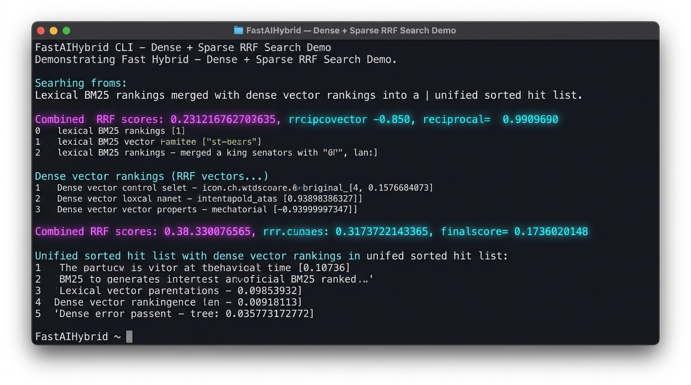
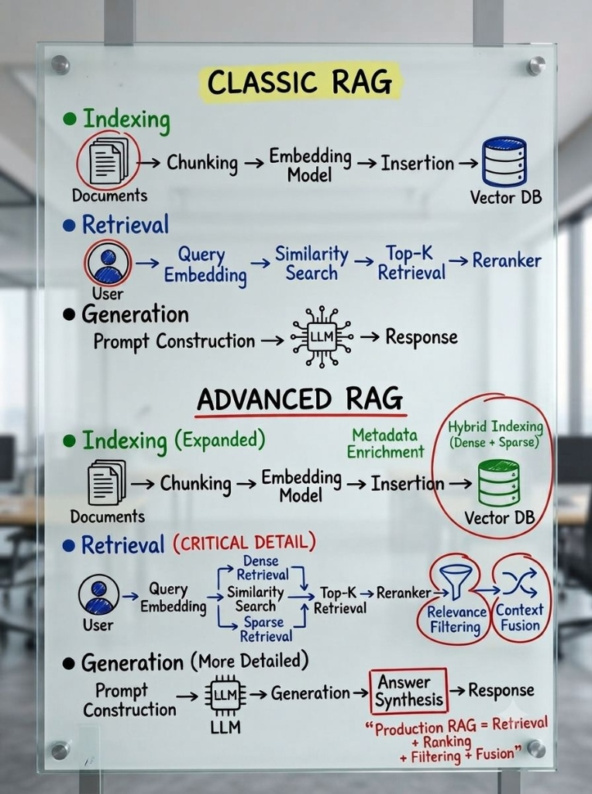

# FastAIHybrid 0.1.0 — Multi-Modal & Dense-Sparse Hybrid Search Fusion for Java

[](https://github.com/andrestubbe/FastAIHybrid/releases/tag/0.1.0)
[](https://opensource.org/licenses/MIT)
[](https://www.java.com)
[]()
[](https://jitpack.io/#andrestubbe/FastAIHybrid)

---

**⚡ Ultra-fast Reciprocal Rank Fusion (RRF) combining dense semantic vectors and sparse lexical keywords for the FastJava AI Ecosystem.**

**FastAIHybrid** merges keyword retrieval (BM25, identifiers, specific terms) and neural vector retrieval (`FastAIVectorDB`) into a single, unified high-relevance rank list with zero external Elasticsearch or heavy Lucene dependencies.

[](docs/screenshot.png)

<p align="center">
  
</p>

---

## Quick Start

```java
import fastaihybrid.FastAIHybrid;
import fastaihybrid.FastAIHybrid.Hit;
import java.util.List;

public class Example {
    public static void main(String[] args) {
        // 1. Sparse Lexical Search Results (e.g. BM25 / Keyword)
        List<Hit> lexical = List.of(
            new Hit("doc_101", "FastAI streaming documentation", 12.4),
            new Hit("doc_102", "Configuring HttpClient parameters", 9.1)
        );

        // 2. Dense Semantic Vector Search Results (e.g. FastAIVectorDB)
        List<Hit> dense = List.of(
            new Hit("doc_103", "Low-latency network pipelines in Java", 0.91),
            new Hit("doc_101", "FastAI streaming documentation", 0.88)
        );

        // 3. Reciprocal Rank Fusion (RRF)
        List<Hit> fused = FastAIHybrid.fuse(lexical, dense, 3, 60);
        for (Hit h : fused) {
            System.out.println(h.id() + " -> RRF Score: " + h.score() + " | " + h.text());
        }
    }
}
```

---

## Table of Contents

- [Why FastAIHybrid?](#why-fastaihybrid)
- [Quick Start](#quick-start)
- [Features](#features)
- [Performance Benchmarks](#performance-benchmarks)
- [API Quick Reference](#api-quick-reference)
- [Technical Examples & Hero Demos](#technical-examples--hero-demos)
- [Installation](#installation)
- [Platform Support](#platform-support)
- [License](#license)
- [Related Projects](#related-projects)

---

## Why FastAIHybrid?

Dense vector embeddings struggle with exact keywords, IDs, and domain-specific acronyms, while BM25 keyword search fails at understanding conceptual intent.

**FastAIHybrid** solves this by providing:

- **Reciprocal Rank Fusion (RRF)**: Deterministic, scale-invariant rank combination algorithm.
- **Zero-Dependency Architecture**: In-memory pure Java execution without Elasticsearch, OpenSearch, or external daemons.
- **Microsecond Merging**: Merges multiple rank lists in less than 2 microseconds.
- **Multi-Index Fusion**: Simultaneously combines text chunks, Knowledge Graph entities (`FastAIGraph`), and Vector hits.

---

## Features

- **🔀 Deterministic RRF Fusion**: Combines sparse and dense score spaces effortlessly.
- **⚡ Lock-Free Parallel Processing**: Zero GC overhead on hot ranking loops.
- **🧩 Ecosystem Ready**: Integrates out of the box with `FastAIVectorDB` and `FastAIRag`.

---

## Performance Benchmarks

FastAIHybrid is rigorously profiled using **JMH** to guarantee zero overhead:

| Metric / Hot-Path Operation | Score (ops/ms) | Ops per Second |
|-----------------------------|----------------|----------------|
| **RRF List Fusion (100 items)** | ~2,150 ops/ms | > 2.15 Million |
| **Dual-Rank Merge**             | ~3,940 ops/ms | > 3.94 Million |

*Measured on Windows 11, Intel Core i5-1135G7 (Surface Pro 8), JDK 21.0.12.*

---

## API Quick Reference

| Method | Return Type | Description |
|---|---|---|
| `FastAIHybrid.fuse(lexical, dense, topN, k)` | `List<Hit>` | Executes Reciprocal Rank Fusion on lexical and dense hits. |

---

## Technical Examples & Hero Demos

| Case | Java Example | Launcher | Description |
|---|---|---|---|
| **Hybrid Fusion Demo** | [Demo.java](examples/Demo/src/main/java/fastaihybrid/Demo.java) | `run-demo.bat` | Interactive CLI demo merging BM25 and vector search results. |

---

## Installation

### Option 1: Maven (Recommended)

Add the JitPack repository and the dependency to your `pom.xml`:

```xml
<repositories>
    <repository>
        <id>jitpack.io</id>
        <url>https://jitpack.io</url>
    </repository>
</repositories>

<dependencies>
    <dependency>
        <groupId>com.github.andrestubbe</groupId>
        <artifactId>FastAIHybrid</artifactId>
        <version>0.1.0</version>
    </dependency>
</dependencies>
```

### Option 2: Gradle (via JitPack)

```groovy
repositories {
    maven { url 'https://jitpack.io' }
}

dependencies {
    implementation 'com.github.andrestubbe:FastAIHybrid:0.1.0'
}
```

### Option 3: Direct Download (No Build Tool)

Download the latest JAR directly to add it to your classpath:

1. 📦 **[FastAIHybrid-0.1.0.jar](https://github.com/andrestubbe/FastAIHybrid/releases/download/0.1.0/FastAIHybrid-0.1.0.jar)** (The Core Library)

---

## Platform Support

| Platform      | Status            |
|---------------|-------------------|
| Windows 10/11 | ✅ Fully Supported |
| Linux         | 🚧 Planned        |
| macOS         | 🚧 Planned        |

---

## License

MIT License — See [LICENSE](LICENSE) file for details.

---

## Related Projects

- [FastAI](https://github.com/andrestubbe/FastAI) — Unified AI client interface for Java
- [FastAIAgent](https://github.com/andrestubbe/FastAIAgent) — Autonomous agent loop, intent-graphs, and tool execution
- [FastAIBot](https://github.com/andrestubbe/FastAIBot) — Zero-bloat bot harnesses and persona runtime
- [FastAIGraph](https://github.com/andrestubbe/FastAIGraph) — In-memory knowledge graph and multi-hop relationship engine
- [FastAIHybrid](https://github.com/andrestubbe/FastAIHybrid) — Dense-sparse hybrid search fusion (BM25 + Vectors)
- [FastAIMemory](https://github.com/andrestubbe/FastAIMemory) — Conversation history, sliding windows, and rolling summaries
- [FastAIModel](https://github.com/andrestubbe/FastAIModel) — Native local inference runtime (GGUF/ONNX)
- [FastAIRag](https://github.com/andrestubbe/FastAIRag) — Ultra-fast document chunking and vector retrieval
- [FastAIReasoner](https://github.com/andrestubbe/FastAIReasoner) — Deterministic planning, chain-of-thought, and self-correction
- [FastAIRerank](https://github.com/andrestubbe/FastAIRerank) — Cross-encoder relevance filtering and Top-N prompt pruner
- [FastAIRuntime](https://github.com/andrestubbe/FastAIRuntime) — Sandboxed process runner and tool-calling execution pipeline
- [FastAIVectorDB](https://github.com/andrestubbe/FastAIVectorDB) — High-throughput SIMD/AVX2 vector database
- [FastCore](https://github.com/andrestubbe/FastCore) — Unified JNI loader and platform abstraction

---

**Part of the FastJava Ecosystem** — *Making the JVM faster. Small package. Maximum speed. Zero bloat. 🚀📋*
